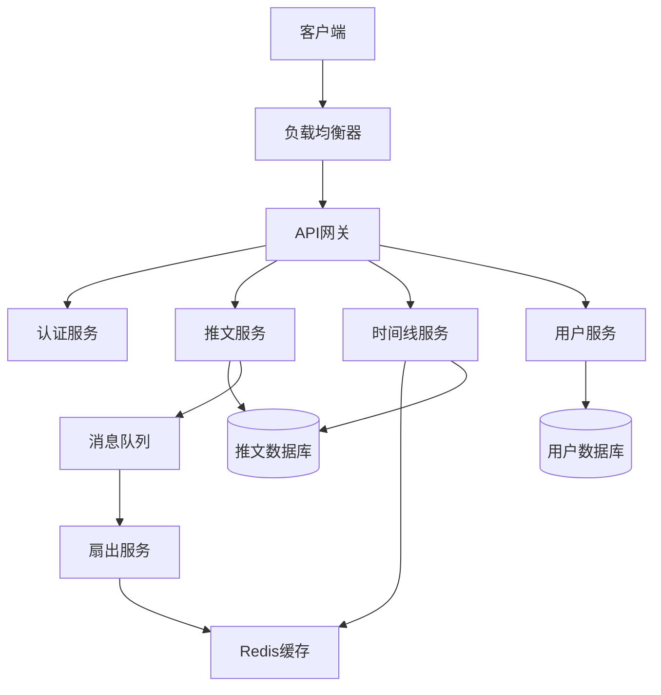

# 系统设计面试指南

## 🎯 学习目标

通过本章节的学习，你将掌握：
- 系统设计面试的基本方法论
- 分布式系统的核心概念
- 常见系统设计模式和最佳实践
- 大规模系统的架构设计思路

## 📋 系统设计面试流程

### 面试结构 (45-60分钟)

1. **需求澄清** (5-10分钟) - 明确功能和非功能需求
2. **容量估算** (5-10分钟) - 计算系统规模和资源需求
3. **高层设计** (10-15分钟) - 设计系统整体架构
4. **详细设计** (10-15分钟) - 深入核心组件设计
5. **扩展讨论** (5-10分钟) - 讨论扩展性和优化方案

### 设计原则

- **可扩展性** (Scalability) - 系统能够处理增长的负载
- **可靠性** (Reliability) - 系统在故障时仍能正常工作
- **可用性** (Availability) - 系统的正常运行时间
- **一致性** (Consistency) - 数据在所有节点上的一致性
- **分区容错性** (Partition Tolerance) - 网络分区时的容错能力

## 🏗️ 系统设计方法论

### 1. 需求澄清

```
功能需求 (Functional Requirements):
- 用户可以发布推文 (最多280字符)
- 用户可以关注其他用户
- 用户可以查看时间线 (自己和关注用户的推文)
- 用户可以搜索推文

非功能需求 (Non-Functional Requirements):
- 系统需要支持1亿日活用户
- 读写比例约为100:1
- 时间线生成延迟 < 200ms
- 系统可用性 99.9%
```

### 2. 容量估算

```
用户规模:
- 总用户数: 1B
- 日活用户: 100M
- 每用户每日发推: 2条
- 每用户每日读取: 200条

存储估算:
- 每日新推文: 100M * 2 = 200M
- 每条推文大小: 280字符 * 2字节 + 元数据 = ~1KB
- 每日存储需求: 200M * 1KB = 200GB
- 5年存储需求: 200GB * 365 * 5 = ~365TB

带宽估算:
- 写入QPS: 200M / (24 * 3600) = ~2300 QPS
- 读取QPS: 100M * 200 / (24 * 3600) = ~230K QPS
- 峰值QPS: 平均QPS * 3 = ~690K QPS
```

### 3. 高层架构设计



## 🔧 核心组件设计

### 数据库设计

```sql
-- 用户表
CREATE TABLE users (
    user_id BIGINT PRIMARY KEY,
    username VARCHAR(50) UNIQUE,
    email VARCHAR(100) UNIQUE,
    created_at TIMESTAMP,
    follower_count INT DEFAULT 0,
    following_count INT DEFAULT 0
);

-- 推文表
CREATE TABLE tweets (
    tweet_id BIGINT PRIMARY KEY,
    user_id BIGINT,
    content TEXT,
    created_at TIMESTAMP,
    like_count INT DEFAULT 0,
    retweet_count INT DEFAULT 0,
    INDEX idx_user_time (user_id, created_at),
    INDEX idx_created_at (created_at)
);

-- 关注关系表
CREATE TABLE follows (
    follower_id BIGINT,
    followee_id BIGINT,
    created_at TIMESTAMP,
    PRIMARY KEY (follower_id, followee_id),
    INDEX idx_followee (followee_id)
);

-- 时间线缓存表
CREATE TABLE timeline_cache (
    user_id BIGINT,
    tweet_id BIGINT,
    created_at TIMESTAMP,
    PRIMARY KEY (user_id, created_at, tweet_id)
);
```

### 缓存策略

```python
# 时间线缓存设计
class TimelineService:
    def __init__(self):
        self.redis = Redis()
        self.tweet_service = TweetService()
    
    def get_timeline(self, user_id, page_size=20, cursor=None):
        cache_key = f"timeline:{user_id}"
        
        # 尝试从缓存获取
        cached_timeline = self.redis.zrevrange(
            cache_key, 
            start=0, 
            end=page_size-1, 
            withscores=True
        )
        
        if len(cached_timeline) >= page_size:
            return self._format_timeline(cached_timeline)
        
        # 缓存未命中，从数据库构建
        return self._build_timeline_from_db(user_id, page_size)
    
    def _build_timeline_from_db(self, user_id, page_size):
        # 获取关注列表
        following_list = self.get_following_list(user_id)
        
        # 获取最新推文
        tweets = self.tweet_service.get_recent_tweets(
            following_list, 
            limit=1000
        )
        
        # 更新缓存
        cache_key = f"timeline:{user_id}"
        pipeline = self.redis.pipeline()
        
        for tweet in tweets:
            pipeline.zadd(
                cache_key, 
                {tweet.id: tweet.created_at.timestamp()}
            )
        
        pipeline.expire(cache_key, 3600)  # 1小时过期
        pipeline.execute()
        
        return tweets[:page_size]
```

### 推送 vs 拉取模式

```python
# 推送模式 (Push Model) - 适合关注者少的用户
class PushTimelineService:
    def on_tweet_created(self, tweet):
        # 获取作者的粉丝列表
        followers = self.get_followers(tweet.user_id)
        
        # 推送到每个粉丝的时间线
        for follower_id in followers:
            self.add_to_timeline(follower_id, tweet)
    
    def add_to_timeline(self, user_id, tweet):
        cache_key = f"timeline:{user_id}"
        self.redis.zadd(
            cache_key,
            {tweet.id: tweet.created_at.timestamp()}
        )
        
        # 保持时间线长度
        self.redis.zremrangebyrank(cache_key, 0, -1001)

# 拉取模式 (Pull Model) - 适合关注者多的用户
class PullTimelineService:
    def get_timeline(self, user_id, page_size=20):
        following_list = self.get_following_list(user_id)
        
        # 从多个用户的推文中合并排序
        all_tweets = []
        for followee_id in following_list:
            tweets = self.get_user_tweets(followee_id, limit=100)
            all_tweets.extend(tweets)
        
        # 按时间排序
        all_tweets.sort(key=lambda x: x.created_at, reverse=True)
        return all_tweets[:page_size]

# 混合模式 - 根据用户类型选择策略
class HybridTimelineService:
    def __init__(self):
        self.push_service = PushTimelineService()
        self.pull_service = PullTimelineService()
    
    def get_timeline(self, user_id, page_size=20):
        user = self.get_user(user_id)
        
        # 名人用户使用拉取模式
        if user.follower_count > 1000000:
            return self.pull_service.get_timeline(user_id, page_size)
        else:
            return self.push_service.get_timeline(user_id, page_size)
```

## 📈 扩展性设计

### 数据库分片

```python
# 一致性哈希分片
class DatabaseSharding:
    def __init__(self, shard_count=1024):
        self.shard_count = shard_count
        self.shards = self._init_shards()
    
    def get_shard(self, key):
        hash_value = self._hash(key)
        shard_id = hash_value % self.shard_count
        return self.shards[shard_id]
    
    def _hash(self, key):
        return hashlib.md5(str(key).encode()).hexdigest()

# 用户ID分片
def get_user_shard(user_id):
    return f"user_db_{user_id % 16}"

# 推文ID分片 (按时间分片)
def get_tweet_shard(tweet_id):
    # 雪花算法生成的ID包含时间戳
    timestamp = extract_timestamp(tweet_id)
    year_month = timestamp.strftime("%Y%m")
    return f"tweet_db_{year_month}"
```

### 负载均衡

```nginx
# Nginx 负载均衡配置
upstream api_servers {
    least_conn;
    server api1.example.com:8080 weight=3;
    server api2.example.com:8080 weight=3;
    server api3.example.com:8080 weight=2;
    server api4.example.com:8080 backup;
}

upstream read_replicas {
    server db-read1.example.com:5432;
    server db-read2.example.com:5432;
    server db-read3.example.com:5432;
}

server {
    listen 80;
    
    location /api/ {
        proxy_pass http://api_servers;
        proxy_set_header Host $host;
        proxy_set_header X-Real-IP $remote_addr;
    }
}
```

### 缓存层设计

```python
# 多级缓存架构
class MultiLevelCache:
    def __init__(self):
        self.l1_cache = {}  # 本地缓存
        self.l2_cache = Redis()  # Redis缓存
        self.l3_cache = Memcached()  # Memcached缓存
    
    def get(self, key):
        # L1 缓存
        if key in self.l1_cache:
            return self.l1_cache[key]
        
        # L2 缓存
        value = self.l2_cache.get(key)
        if value:
            self.l1_cache[key] = value
            return value
        
        # L3 缓存
        value = self.l3_cache.get(key)
        if value:
            self.l2_cache.setex(key, 3600, value)
            self.l1_cache[key] = value
            return value
        
        return None
    
    def set(self, key, value, ttl=3600):
        self.l1_cache[key] = value
        self.l2_cache.setex(key, ttl, value)
        self.l3_cache.set(key, value, ttl)
```

## 🛡️ 可靠性设计

### 断路器模式

```python
import time
from enum import Enum

class CircuitState(Enum):
    CLOSED = "closed"
    OPEN = "open"
    HALF_OPEN = "half_open"

class CircuitBreaker:
    def __init__(self, failure_threshold=5, timeout=60):
        self.failure_threshold = failure_threshold
        self.timeout = timeout
        self.failure_count = 0
        self.last_failure_time = None
        self.state = CircuitState.CLOSED
    
    def call(self, func, *args, **kwargs):
        if self.state == CircuitState.OPEN:
            if time.time() - self.last_failure_time > self.timeout:
                self.state = CircuitState.HALF_OPEN
            else:
                raise Exception("Circuit breaker is OPEN")
        
        try:
            result = func(*args, **kwargs)
            self._on_success()
            return result
        except Exception as e:
            self._on_failure()
            raise e
    
    def _on_success(self):
        self.failure_count = 0
        self.state = CircuitState.CLOSED
    
    def _on_failure(self):
        self.failure_count += 1
        self.last_failure_time = time.time()
        
        if self.failure_count >= self.failure_threshold:
            self.state = CircuitState.OPEN
```

### 重试机制

```python
import random
import time
from functools import wraps

def retry_with_backoff(max_retries=3, base_delay=1, max_delay=60):
    def decorator(func):
        @wraps(func)
        def wrapper(*args, **kwargs):
            for attempt in range(max_retries + 1):
                try:
                    return func(*args, **kwargs)
                except Exception as e:
                    if attempt == max_retries:
                        raise e
                    
                    # 指数退避 + 随机抖动
                    delay = min(base_delay * (2 ** attempt), max_delay)
                    jitter = random.uniform(0, delay * 0.1)
                    time.sleep(delay + jitter)
            
        return wrapper
    return decorator

@retry_with_backoff(max_retries=3)
def call_external_api():
    # 可能失败的外部API调用
    pass
```

## 🔍 监控和可观测性

### 指标监控

```python
# 关键指标定义
class Metrics:
    def __init__(self):
        self.request_count = Counter('requests_total')
        self.request_duration = Histogram('request_duration_seconds')
        self.error_rate = Counter('errors_total')
        self.active_users = Gauge('active_users')
    
    def record_request(self, endpoint, status_code, duration):
        self.request_count.labels(
            endpoint=endpoint, 
            status=status_code
        ).inc()
        
        self.request_duration.labels(endpoint=endpoint).observe(duration)
        
        if status_code >= 400:
            self.error_rate.labels(
                endpoint=endpoint,
                error_type=self._get_error_type(status_code)
            ).inc()

# SLA 指标
SLA_TARGETS = {
    'availability': 99.9,  # 99.9% 可用性
    'latency_p99': 200,    # 99% 请求 < 200ms
    'error_rate': 0.1      # 错误率 < 0.1%
}
```

### 分布式追踪

```python
# 分布式追踪实现
import uuid
from contextvars import ContextVar

trace_id_var: ContextVar[str] = ContextVar('trace_id')

class DistributedTracing:
    @staticmethod
    def start_trace():
        trace_id = str(uuid.uuid4())
        trace_id_var.set(trace_id)
        return trace_id
    
    @staticmethod
    def get_trace_id():
        return trace_id_var.get(None)
    
    @staticmethod
    def create_span(operation_name, parent_span_id=None):
        span_id = str(uuid.uuid4())
        trace_id = DistributedTracing.get_trace_id()
        
        span = {
            'trace_id': trace_id,
            'span_id': span_id,
            'parent_span_id': parent_span_id,
            'operation_name': operation_name,
            'start_time': time.time(),
            'tags': {}
        }
        
        return span

# 使用示例
def process_request():
    trace_id = DistributedTracing.start_trace()
    
    with create_span('user_service.get_user') as span:
        user = get_user(user_id)
    
    with create_span('timeline_service.get_timeline') as span:
        timeline = get_timeline(user_id)
    
    return timeline
```

## 📖 常见系统设计题目

### 1. 设计Twitter/微博系统
- **核心功能**: 发推文、关注、时间线
- **关键挑战**: 名人用户的扇出问题
- **解决方案**: 推拉结合的混合模式

### 2. 设计聊天系统
- **核心功能**: 实时消息、群聊、在线状态
- **关键挑战**: 实时性、消息可靠性
- **解决方案**: WebSocket + 消息队列

### 3. 设计短链接服务
- **核心功能**: 长链接转短链接、重定向
- **关键挑战**: 高并发读取、全局唯一ID
- **解决方案**: Base62编码 + 缓存

### 4. 设计视频流媒体系统
- **核心功能**: 视频上传、转码、播放
- **关键挑战**: 存储成本、CDN分发
- **解决方案**: 分层存储 + 全球CDN

### 5. 设计搜索引擎
- **核心功能**: 网页爬取、索引、搜索
- **关键挑战**: 数据规模、查询速度
- **解决方案**: 倒排索引 + 分布式存储

## 💡 面试技巧

### 沟通技巧
1. **主动澄清需求** - 不要假设，要主动询问
2. **从简单开始** - 先设计基本版本，再逐步优化
3. **权衡取舍** - 明确说明设计决策的原因
4. **承认不足** - 诚实面对不了解的技术

### 常见陷阱
1. **过度设计** - 不要一开始就设计复杂系统
2. **忽略约束** - 要考虑现实的资源和时间约束
3. **缺乏数据** - 要基于具体数据做设计决策
4. **技术细节** - 不要陷入过多的实现细节

---

🎯 **系统设计面试的关键在于展示你的思考过程和解决问题的能力。** 通过系统性的方法论和大量的练习，你可以在面试中自信地设计出可扩展的分布式系统。
