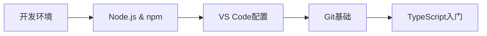
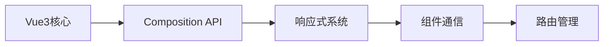
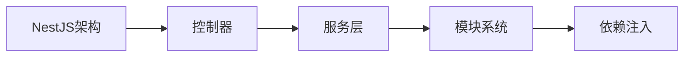
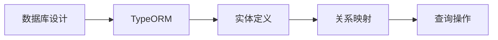
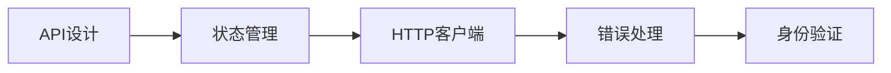
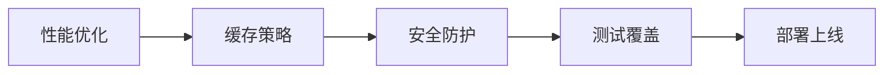

# 🛣️ NestJS + Vue3 全栈开发学习路线图

## 📋 总体学习规划

本学习路线图专为想要掌握 **NestJS + Vue3 + TypeORM** 技术栈的开发者设计，从零基础到企业级应用开发的完整路径。

## 🎯 学习目标

完成本路线图后，你将能够：
- 独立开发现代化的全栈Web应用
- 掌握企业级开发的最佳实践
- 具备解决复杂业务问题的能力
- 胜任全栈开发工程师的工作要求

## 📊 技能等级划分

### 🟢 初级 (0-3个月)
- 掌握基础语法和核心概念
- 能够完成简单的CRUD应用
- 理解前后端分离的开发模式

### 🟡 中级 (3-6个月)
- 熟练使用框架的高级特性
- 能够设计合理的应用架构
- 掌握常见的设计模式

### 🔴 高级 (6-12个月)
- 具备性能优化能力
- 能够处理复杂的业务场景
- 掌握微服务和分布式系统

## 🗓️ 学习时间线

### 第1-2周：环境搭建与基础准备

**学习内容：**
- [x] Node.js 18+ 安装与配置
- [x] 包管理器选择 (npm/yarn/pnpm)
- [x] VS Code 插件推荐
- [x] Git 版本控制基础
- [x] TypeScript 基础语法

**实践项目：** 创建第一个TypeScript项目

### 第3-4周：Vue3 前端基础

**学习内容：**
- [x] Vue3 核心概念与Composition API
- [x] 响应式系统原理
- [x] 组件开发与通信
- [x] Vue Router 路由管理
- [x] Vite 构建工具

**实践项目：** 个人博客前端页面

### 第5-6周：NestJS 后端基础

**学习内容：**
- [x] NestJS 架构设计理念
- [x] 控制器与路由
- [x] 服务与依赖注入
- [x] 模块系统
- [x] 中间件与管道

**实践项目：** RESTful API 开发

### 第7-8周：数据库与ORM

**学习内容：**
- [x] 数据库设计原则
- [x] TypeORM 配置与使用
- [x] 实体定义与装饰器
- [x] 关系映射 (一对一、一对多、多对多)
- [x] 查询构建器与原生SQL

**实践项目：** 用户管理系统

### 第9-10周：前后端整合

**学习内容：**
- [x] RESTful API 设计规范
- [x] Pinia 状态管理
- [x] Axios HTTP 客户端
- [x] 错误处理与异常管理
- [x] JWT 身份验证

**实践项目：** 完整的全栈应用

### 第11-12周：高级特性与优化

**学习内容：**
- [x] 前端性能优化
- [x] 后端缓存策略
- [x] 安全防护措施
- [x] 单元测试与集成测试
- [x] Docker 容器化部署

**实践项目：** 企业级应用开发

## 📚 核心技术栈详解

### 前端技术栈
| 技术 | 用途 | 学习优先级 | 预计时间 |
|------|------|------------|----------|
| **Vue3** | 前端框架 | ⭐⭐⭐⭐⭐ | 2周 |
| **TypeScript** | 类型系统 | ⭐⭐⭐⭐⭐ | 1周 |
| **Vite** | 构建工具 | ⭐⭐⭐⭐ | 3天 |
| **Pinia** | 状态管理 | ⭐⭐⭐⭐ | 1周 |
| **Vue Router** | 路由管理 | ⭐⭐⭐⭐ | 3天 |

### 后端技术栈
| 技术 | 用途 | 学习优先级 | 预计时间 |
|------|------|------------|----------|
| **NestJS** | 后端框架 | ⭐⭐⭐⭐⭐ | 3周 |
| **TypeORM** | ORM框架 | ⭐⭐⭐⭐⭐ | 2周 |
| **PostgreSQL** | 数据库 | ⭐⭐⭐⭐ | 1周 |
| **GraphQL** | 查询语言 | ⭐⭐⭐ | 1周 |
| **Redis** | 缓存 | ⭐⭐⭐ | 3天 |

## 🎓 学习资源推荐

### 官方文档
- [Vue3 官方文档](https://vuejs.org/)
- [NestJS 官方文档](https://nestjs.com/)
- [TypeORM 官方文档](https://typeorm.io/)

### 视频教程
- [Vue3 从入门到实战](https://www.bilibili.com/video/BV1dS4y1y7vd)
- [NestJS 企业级开发](https://www.bilibili.com/video/BV1RP4y1p7Xr)
- [TypeScript 深入浅出](https://www.bilibili.com/video/BV1Xy4y1v7S2)

### 实战项目
- [Vue3 + NestJS 博客系统](https://github.com/example/blog-system)
- [电商管理平台](https://github.com/example/ecommerce-admin)
- [任务管理系统](https://github.com/example/task-manager)

## 🏆 学习成果检验

### 阶段性测试
- **第4周**：Vue3 基础能力测试
- **第8周**：NestJS 后端开发测试
- **第12周**：全栈项目综合测试

### 项目作品集
1. **个人博客系统** - 展示前端技能
2. **API 服务** - 展示后端技能
3. **全栈应用** - 展示整合能力

## 🚀 进阶学习方向

完成基础学习后，可以选择以下进阶方向：

### 🔧 技术深化
- **微服务架构** - 学习服务拆分与治理
- **GraphQL** - 掌握现代API查询语言
- **WebSocket** - 实现实时通信功能

### 🛠️ 工程化提升
- **自动化测试** - 单元测试、集成测试、E2E测试
- **CI/CD** - 持续集成与持续部署
- **监控运维** - 应用性能监控与日志管理

### 📱 技术拓展
- **移动端开发** - React Native / Flutter
- **桌面应用** - Electron
- **服务端渲染** - Nuxt.js

## 💡 学习建议

### 学习方法
1. **理论与实践结合** - 每学一个概念就动手实践
2. **项目驱动学习** - 通过实际项目巩固知识
3. **社区参与** - 加入技术社区，与他人交流
4. **持续更新** - 关注技术发展，及时学习新特性

### 常见误区
- ❌ 只看不练，缺乏实际操作
- ❌ 追求新技术，忽视基础知识
- ❌ 孤立学习，缺乏系统性
- ❌ 急于求成，跳过重要概念

### 学习节奏
- **每日学习** - 保持1-2小时的学习时间
- **周末实践** - 利用周末时间做项目
- **定期复习** - 每周回顾所学内容
- **阶段总结** - 每月总结学习成果

---

🎯 **准备好开始你的全栈开发之旅了吗？** [选择你的学习路径 →](/roadmap/frontend)
