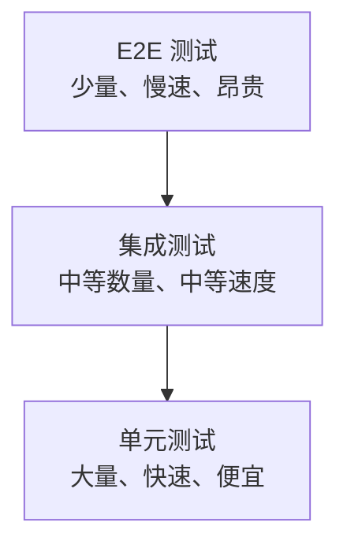

# 前端测试完整指南

## 🎯 学习目标

通过本章节的学习，你将掌握：
- 前端测试的基本概念和测试金字塔
- Vue3 + Vitest 单元测试最佳实践
- 组件测试和集成测试技巧
- E2E 测试和性能测试方法

## 📊 测试金字塔



### 测试类型对比

| 测试类型 | 数量比例 | 执行速度 | 维护成本 | 覆盖范围 | 反馈速度 |
|---------|---------|---------|---------|---------|---------|
| 单元测试 | 70% | 快 | 低 | 小 | 快 |
| 集成测试 | 20% | 中 | 中 | 中 | 中 |
| E2E测试 | 10% | 慢 | 高 | 大 | 慢 |

## 🧪 Vitest 单元测试

### 环境配置

```bash
# 安装测试依赖
npm install -D vitest @vue/test-utils jsdom
npm install -D @testing-library/vue @testing-library/jest-dom
npm install -D @testing-library/user-event
```

```javascript
// vitest.config.js
import { defineConfig } from 'vitest/config'
import vue from '@vitejs/plugin-vue'
import { resolve } from 'path'

export default defineConfig({
  plugins: [vue()],
  test: {
    // 测试环境
    environment: 'jsdom',
    
    // 全局设置
    globals: true,
    
    // 设置文件
    setupFiles: ['./tests/setup.js'],
    
    // 覆盖率配置
    coverage: {
      provider: 'v8',
      reporter: ['text', 'json', 'html'],
      exclude: [
        'node_modules/',
        'tests/',
        '**/*.d.ts',
        '**/*.config.js'
      ]
    },
    
    // 测试文件匹配
    include: ['**/*.{test,spec}.{js,ts,vue}'],
    
    // 并发执行
    threads: true,
    
    // 超时设置
    testTimeout: 10000
  },
  
  resolve: {
    alias: {
      '@': resolve(__dirname, './src')
    }
  }
})
```

```javascript
// tests/setup.js
import { expect, afterEach } from 'vitest'
import { cleanup } from '@testing-library/vue'
import * as matchers from '@testing-library/jest-dom/matchers'

// 扩展 expect 匹配器
expect.extend(matchers)

// 每个测试后清理
afterEach(() => {
  cleanup()
})

// 全局模拟
Object.defineProperty(window, 'matchMedia', {
  writable: true,
  value: vi.fn().mockImplementation(query => ({
    matches: false,
    media: query,
    onchange: null,
    addListener: vi.fn(),
    removeListener: vi.fn(),
    addEventListener: vi.fn(),
    removeEventListener: vi.fn(),
    dispatchEvent: vi.fn(),
  })),
})
```

### 基础测试示例

```javascript
// src/utils/math.js
export function add(a, b) {
  return a + b
}

export function divide(a, b) {
  if (b === 0) {
    throw new Error('Division by zero')
  }
  return a / b
}

export function formatCurrency(amount) {
  return new Intl.NumberFormat('zh-CN', {
    style: 'currency',
    currency: 'CNY'
  }).format(amount)
}
```

```javascript
// tests/utils/math.test.js
import { describe, it, expect } from 'vitest'
import { add, divide, formatCurrency } from '@/utils/math'

describe('Math Utils', () => {
  describe('add', () => {
    it('should add two positive numbers', () => {
      expect(add(2, 3)).toBe(5)
    })

    it('should handle negative numbers', () => {
      expect(add(-1, 1)).toBe(0)
      expect(add(-2, -3)).toBe(-5)
    })

    it('should handle decimal numbers', () => {
      expect(add(0.1, 0.2)).toBeCloseTo(0.3)
    })
  })

  describe('divide', () => {
    it('should divide two numbers', () => {
      expect(divide(10, 2)).toBe(5)
    })

    it('should throw error when dividing by zero', () => {
      expect(() => divide(10, 0)).toThrow('Division by zero')
    })

    it('should handle decimal division', () => {
      expect(divide(1, 3)).toBeCloseTo(0.333, 2)
    })
  })

  describe('formatCurrency', () => {
    it('should format currency correctly', () => {
      expect(formatCurrency(1234.56)).toBe('¥1,234.56')
    })

    it('should handle zero', () => {
      expect(formatCurrency(0)).toBe('¥0.00')
    })
  })
})
```

## 🧩 Vue 组件测试

### 基础组件测试

```vue
<!-- src/components/Counter.vue -->
<template>
  <div class="counter">
    <h2>{{ title }}</h2>
    <p data-testid="count">Count: {{ count }}</p>
    <button @click="increment" data-testid="increment">+</button>
    <button @click="decrement" data-testid="decrement">-</button>
    <button @click="reset" data-testid="reset">Reset</button>
  </div>
</template>

<script setup>
import { ref } from 'vue'

const props = defineProps({
  title: {
    type: String,
    default: 'Counter'
  },
  initialValue: {
    type: Number,
    default: 0
  }
})

const emit = defineEmits(['change'])

const count = ref(props.initialValue)

const increment = () => {
  count.value++
  emit('change', count.value)
}

const decrement = () => {
  count.value--
  emit('change', count.value)
}

const reset = () => {
  count.value = props.initialValue
  emit('change', count.value)
}
</script>
```

```javascript
// tests/components/Counter.test.js
import { describe, it, expect, vi } from 'vitest'
import { render, screen, fireEvent } from '@testing-library/vue'
import Counter from '@/components/Counter.vue'

describe('Counter Component', () => {
  it('renders with default props', () => {
    render(Counter)
    
    expect(screen.getByText('Counter')).toBeInTheDocument()
    expect(screen.getByTestId('count')).toHaveTextContent('Count: 0')
  })

  it('renders with custom props', () => {
    render(Counter, {
      props: {
        title: 'Custom Counter',
        initialValue: 5
      }
    })
    
    expect(screen.getByText('Custom Counter')).toBeInTheDocument()
    expect(screen.getByTestId('count')).toHaveTextContent('Count: 5')
  })

  it('increments count when increment button is clicked', async () => {
    render(Counter)
    
    const incrementButton = screen.getByTestId('increment')
    await fireEvent.click(incrementButton)
    
    expect(screen.getByTestId('count')).toHaveTextContent('Count: 1')
  })

  it('decrements count when decrement button is clicked', async () => {
    render(Counter, {
      props: { initialValue: 5 }
    })
    
    const decrementButton = screen.getByTestId('decrement')
    await fireEvent.click(decrementButton)
    
    expect(screen.getByTestId('count')).toHaveTextContent('Count: 4')
  })

  it('resets count when reset button is clicked', async () => {
    const { getByTestId } = render(Counter, {
      props: { initialValue: 10 }
    })
    
    // 先改变计数
    await fireEvent.click(getByTestId('increment'))
    expect(getByTestId('count')).toHaveTextContent('Count: 11')
    
    // 然后重置
    await fireEvent.click(getByTestId('reset'))
    expect(getByTestId('count')).toHaveTextContent('Count: 10')
  })

  it('emits change event with correct value', async () => {
    const { emitted } = render(Counter)
    
    await fireEvent.click(screen.getByTestId('increment'))
    
    expect(emitted()).toHaveProperty('change')
    expect(emitted().change[0]).toEqual([1])
  })
})
```

### 复杂组件测试

```vue
<!-- src/components/UserForm.vue -->
<template>
  <form @submit.prevent="handleSubmit" class="user-form">
    <div class="form-group">
      <label for="username">用户名:</label>
      <input
        id="username"
        v-model="form.username"
        type="text"
        :class="{ error: errors.username }"
        data-testid="username-input"
      />
      <span v-if="errors.username" class="error-message">
        {{ errors.username }}
      </span>
    </div>

    <div class="form-group">
      <label for="email">邮箱:</label>
      <input
        id="email"
        v-model="form.email"
        type="email"
        :class="{ error: errors.email }"
        data-testid="email-input"
      />
      <span v-if="errors.email" class="error-message">
        {{ errors.email }}
      </span>
    </div>

    <button 
      type="submit" 
      :disabled="!isValid || loading"
      data-testid="submit-button"
    >
      {{ loading ? '提交中...' : '提交' }}
    </button>
  </form>
</template>

<script setup>
import { ref, computed, watch } from 'vue'

const props = defineProps({
  initialData: {
    type: Object,
    default: () => ({})
  }
})

const emit = defineEmits(['submit'])

const form = ref({
  username: props.initialData.username || '',
  email: props.initialData.email || ''
})

const errors = ref({})
const loading = ref(false)

const isValid = computed(() => {
  return form.value.username && 
         form.value.email && 
         Object.keys(errors.value).length === 0
})

const validateField = (field, value) => {
  switch (field) {
    case 'username':
      if (!value) {
        errors.value.username = '用户名不能为空'
      } else if (value.length < 3) {
        errors.value.username = '用户名至少3个字符'
      } else {
        delete errors.value.username
      }
      break
    case 'email':
      const emailRegex = /^[^\s@]+@[^\s@]+\.[^\s@]+$/
      if (!value) {
        errors.value.email = '邮箱不能为空'
      } else if (!emailRegex.test(value)) {
        errors.value.email = '邮箱格式不正确'
      } else {
        delete errors.value.email
      }
      break
  }
}

watch(() => form.value.username, (value) => {
  validateField('username', value)
})

watch(() => form.value.email, (value) => {
  validateField('email', value)
})

const handleSubmit = async () => {
  loading.value = true
  try {
    await emit('submit', form.value)
  } finally {
    loading.value = false
  }
}
</script>
```

```javascript
// tests/components/UserForm.test.js
import { describe, it, expect, vi } from 'vitest'
import { render, screen, fireEvent, waitFor } from '@testing-library/vue'
import userEvent from '@testing-library/user-event'
import UserForm from '@/components/UserForm.vue'

describe('UserForm Component', () => {
  it('renders form fields', () => {
    render(UserForm)
    
    expect(screen.getByLabelText('用户名:')).toBeInTheDocument()
    expect(screen.getByLabelText('邮箱:')).toBeInTheDocument()
    expect(screen.getByTestId('submit-button')).toBeInTheDocument()
  })

  it('renders with initial data', () => {
    const initialData = {
      username: 'testuser',
      email: 'test@example.com'
    }
    
    render(UserForm, {
      props: { initialData }
    })
    
    expect(screen.getByTestId('username-input')).toHaveValue('testuser')
    expect(screen.getByTestId('email-input')).toHaveValue('test@example.com')
  })

  it('validates username field', async () => {
    const user = userEvent.setup()
    render(UserForm)
    
    const usernameInput = screen.getByTestId('username-input')
    
    // 测试空值验证
    await user.type(usernameInput, 'a')
    await user.clear(usernameInput)
    
    await waitFor(() => {
      expect(screen.getByText('用户名不能为空')).toBeInTheDocument()
    })
    
    // 测试长度验证
    await user.type(usernameInput, 'ab')
    
    await waitFor(() => {
      expect(screen.getByText('用户名至少3个字符')).toBeInTheDocument()
    })
    
    // 测试有效输入
    await user.type(usernameInput, 'c')
    
    await waitFor(() => {
      expect(screen.queryByText('用户名至少3个字符')).not.toBeInTheDocument()
    })
  })

  it('validates email field', async () => {
    const user = userEvent.setup()
    render(UserForm)
    
    const emailInput = screen.getByTestId('email-input')
    
    // 测试无效邮箱
    await user.type(emailInput, 'invalid-email')
    
    await waitFor(() => {
      expect(screen.getByText('邮箱格式不正确')).toBeInTheDocument()
    })
    
    // 测试有效邮箱
    await user.clear(emailInput)
    await user.type(emailInput, 'test@example.com')
    
    await waitFor(() => {
      expect(screen.queryByText('邮箱格式不正确')).not.toBeInTheDocument()
    })
  })

  it('disables submit button when form is invalid', async () => {
    render(UserForm)
    
    const submitButton = screen.getByTestId('submit-button')
    expect(submitButton).toBeDisabled()
  })

  it('enables submit button when form is valid', async () => {
    const user = userEvent.setup()
    render(UserForm)
    
    await user.type(screen.getByTestId('username-input'), 'testuser')
    await user.type(screen.getByTestId('email-input'), 'test@example.com')
    
    await waitFor(() => {
      expect(screen.getByTestId('submit-button')).not.toBeDisabled()
    })
  })

  it('emits submit event with form data', async () => {
    const user = userEvent.setup()
    const { emitted } = render(UserForm)
    
    await user.type(screen.getByTestId('username-input'), 'testuser')
    await user.type(screen.getByTestId('email-input'), 'test@example.com')
    
    await user.click(screen.getByTestId('submit-button'))
    
    expect(emitted()).toHaveProperty('submit')
    expect(emitted().submit[0]).toEqual([{
      username: 'testuser',
      email: 'test@example.com'
    }])
  })

  it('shows loading state during submission', async () => {
    const user = userEvent.setup()
    
    // 模拟异步提交
    const mockSubmit = vi.fn(() => new Promise(resolve => setTimeout(resolve, 100)))
    
    render(UserForm, {
      props: {
        onSubmit: mockSubmit
      }
    })
    
    await user.type(screen.getByTestId('username-input'), 'testuser')
    await user.type(screen.getByTestId('email-input'), 'test@example.com')
    
    await user.click(screen.getByTestId('submit-button'))
    
    expect(screen.getByText('提交中...')).toBeInTheDocument()
    expect(screen.getByTestId('submit-button')).toBeDisabled()
  })
})
```

## 🔗 集成测试

### API 集成测试

```javascript
// tests/integration/api.test.js
import { describe, it, expect, beforeEach, afterEach, vi } from 'vitest'
import { createApp } from 'vue'
import { createPinia } from 'pinia'
import { useUserStore } from '@/stores/user'

// 模拟 fetch
global.fetch = vi.fn()

describe('User Store Integration', () => {
  let app
  let pinia
  let userStore

  beforeEach(() => {
    app = createApp({})
    pinia = createPinia()
    app.use(pinia)
    userStore = useUserStore()
    
    // 重置 fetch mock
    fetch.mockClear()
  })

  afterEach(() => {
    app.unmount()
  })

  it('should fetch and store user data', async () => {
    const mockUser = {
      id: 1,
      name: 'John Doe',
      email: 'john@example.com'
    }

    fetch.mockResolvedValueOnce({
      ok: true,
      json: async () => mockUser
    })

    await userStore.fetchUser(1)

    expect(fetch).toHaveBeenCalledWith('/api/users/1')
    expect(userStore.currentUser).toEqual(mockUser)
  })

  it('should handle API errors', async () => {
    fetch.mockRejectedValueOnce(new Error('Network error'))

    await expect(userStore.fetchUser(1)).rejects.toThrow('Network error')
    expect(userStore.currentUser).toBeNull()
    expect(userStore.error).toBe('Failed to fetch user')
  })

  it('should update user data', async () => {
    const updatedUser = {
      id: 1,
      name: 'Jane Doe',
      email: 'jane@example.com'
    }

    fetch.mockResolvedValueOnce({
      ok: true,
      json: async () => updatedUser
    })

    await userStore.updateUser(1, { name: 'Jane Doe' })

    expect(fetch).toHaveBeenCalledWith('/api/users/1', {
      method: 'PUT',
      headers: { 'Content-Type': 'application/json' },
      body: JSON.stringify({ name: 'Jane Doe' })
    })
    expect(userStore.currentUser).toEqual(updatedUser)
  })
})
```

### 路由集成测试

```javascript
// tests/integration/router.test.js
import { describe, it, expect } from 'vitest'
import { mount } from '@vue/test-utils'
import { createRouter, createWebHistory } from 'vue-router'
import App from '@/App.vue'
import Home from '@/views/Home.vue'
import About from '@/views/About.vue'

const routes = [
  { path: '/', component: Home },
  { path: '/about', component: About }
]

describe('Router Integration', () => {
  it('should navigate to different routes', async () => {
    const router = createRouter({
      history: createWebHistory(),
      routes
    })

    const wrapper = mount(App, {
      global: {
        plugins: [router]
      }
    })

    // 初始路由
    expect(wrapper.findComponent(Home).exists()).toBe(true)

    // 导航到 about 页面
    await router.push('/about')
    await wrapper.vm.$nextTick()

    expect(wrapper.findComponent(About).exists()).toBe(true)
    expect(wrapper.findComponent(Home).exists()).toBe(false)
  })

  it('should handle route guards', async () => {
    const router = createRouter({
      history: createWebHistory(),
      routes: [
        {
          path: '/protected',
          component: { template: '<div>Protected</div>' },
          beforeEnter: (to, from, next) => {
            // 模拟认证检查
            const isAuthenticated = false
            if (isAuthenticated) {
              next()
            } else {
              next('/login')
            }
          }
        },
        {
          path: '/login',
          component: { template: '<div>Login</div>' }
        }
      ]
    })

    await router.push('/protected')
    
    expect(router.currentRoute.value.path).toBe('/login')
  })
})
```

## 🎭 E2E 测试

### Playwright E2E 测试

```bash
# 安装 Playwright
npm install -D @playwright/test
npx playwright install
```

```javascript
// playwright.config.js
import { defineConfig, devices } from '@playwright/test'

export default defineConfig({
  testDir: './tests/e2e',
  fullyParallel: true,
  forbidOnly: !!process.env.CI,
  retries: process.env.CI ? 2 : 0,
  workers: process.env.CI ? 1 : undefined,
  reporter: 'html',
  
  use: {
    baseURL: 'http://localhost:5173',
    trace: 'on-first-retry',
    screenshot: 'only-on-failure'
  },

  projects: [
    {
      name: 'chromium',
      use: { ...devices['Desktop Chrome'] },
    },
    {
      name: 'firefox',
      use: { ...devices['Desktop Firefox'] },
    },
    {
      name: 'webkit',
      use: { ...devices['Desktop Safari'] },
    },
    {
      name: 'Mobile Chrome',
      use: { ...devices['Pixel 5'] },
    }
  ],

  webServer: {
    command: 'npm run dev',
    url: 'http://localhost:5173',
    reuseExistingServer: !process.env.CI
  }
})
```

```javascript
// tests/e2e/user-flow.spec.js
import { test, expect } from '@playwright/test'

test.describe('User Registration Flow', () => {
  test('should complete user registration', async ({ page }) => {
    // 访问注册页面
    await page.goto('/register')
    
    // 填写表单
    await page.fill('[data-testid="username-input"]', 'testuser')
    await page.fill('[data-testid="email-input"]', 'test@example.com')
    await page.fill('[data-testid="password-input"]', 'password123')
    
    // 提交表单
    await page.click('[data-testid="submit-button"]')
    
    // 验证成功消息
    await expect(page.locator('[data-testid="success-message"]')).toBeVisible()
    await expect(page.locator('[data-testid="success-message"]')).toContainText('注册成功')
    
    // 验证重定向到登录页面
    await expect(page).toHaveURL('/login')
  })

  test('should show validation errors', async ({ page }) => {
    await page.goto('/register')
    
    // 提交空表单
    await page.click('[data-testid="submit-button"]')
    
    // 验证错误消息
    await expect(page.locator('[data-testid="username-error"]')).toBeVisible()
    await expect(page.locator('[data-testid="email-error"]')).toBeVisible()
    await expect(page.locator('[data-testid="password-error"]')).toBeVisible()
  })

  test('should handle API errors', async ({ page }) => {
    // 模拟 API 错误
    await page.route('/api/register', route => {
      route.fulfill({
        status: 400,
        contentType: 'application/json',
        body: JSON.stringify({ error: '用户名已存在' })
      })
    })

    await page.goto('/register')
    await page.fill('[data-testid="username-input"]', 'existinguser')
    await page.fill('[data-testid="email-input"]', 'test@example.com')
    await page.fill('[data-testid="password-input"]', 'password123')
    await page.click('[data-testid="submit-button"]')

    await expect(page.locator('[data-testid="error-message"]')).toContainText('用户名已存在')
  })
})

test.describe('Performance Tests', () => {
  test('should load homepage within performance budget', async ({ page }) => {
    const startTime = Date.now()
    
    await page.goto('/')
    
    // 等待页面完全加载
    await page.waitForLoadState('networkidle')
    
    const loadTime = Date.now() - startTime
    
    // 验证加载时间 < 3秒
    expect(loadTime).toBeLessThan(3000)
    
    // 验证 Core Web Vitals
    const lcp = await page.evaluate(() => {
      return new Promise(resolve => {
        new PerformanceObserver(list => {
          const entries = list.getEntries()
          const lastEntry = entries[entries.length - 1]
          resolve(lastEntry.startTime)
        }).observe({ entryTypes: ['largest-contentful-paint'] })
      })
    })
    
    expect(lcp).toBeLessThan(2500) // LCP < 2.5s
  })
})
```

## 📊 测试覆盖率和报告

### 覆盖率配置

```javascript
// vitest.config.js 覆盖率配置
export default defineConfig({
  test: {
    coverage: {
      provider: 'v8',
      reporter: ['text', 'json', 'html', 'lcov'],
      reportsDirectory: './coverage',
      exclude: [
        'node_modules/',
        'tests/',
        '**/*.d.ts',
        '**/*.config.js',
        '**/index.js',
        'src/main.js'
      ],
      thresholds: {
        global: {
          branches: 80,
          functions: 80,
          lines: 80,
          statements: 80
        }
      }
    }
  }
})
```

### CI/CD 集成

```yaml
# .github/workflows/test.yml
name: Test

on: [push, pull_request]

jobs:
  test:
    runs-on: ubuntu-latest
    
    steps:
      - uses: actions/checkout@v4
      
      - name: Setup Node.js
        uses: actions/setup-node@v4
        with:
          node-version: '18'
          cache: 'npm'
      
      - name: Install dependencies
        run: npm ci
      
      - name: Run unit tests
        run: npm run test:unit
      
      - name: Run integration tests
        run: npm run test:integration
      
      - name: Install Playwright
        run: npx playwright install --with-deps
      
      - name: Run E2E tests
        run: npm run test:e2e
      
      - name: Upload coverage reports
        uses: codecov/codecov-action@v3
        with:
          file: ./coverage/lcov.info
      
      - name: Upload test results
        uses: actions/upload-artifact@v3
        if: failure()
        with:
          name: test-results
          path: test-results/
```

## 📖 测试最佳实践

### 测试原则
1. **AAA 模式** - Arrange, Act, Assert
2. **单一职责** - 每个测试只验证一个功能点
3. **独立性** - 测试之间不应相互依赖
4. **可重复性** - 测试结果应该一致
5. **快速反馈** - 测试应该快速执行

### 命名规范
```javascript
// 好的测试命名
describe('UserService', () => {
  describe('when user is authenticated', () => {
    it('should return user profile', () => {})
    it('should throw error when user not found', () => {})
  })
  
  describe('when user is not authenticated', () => {
    it('should redirect to login page', () => {})
  })
})
```

### 测试数据管理
```javascript
// 使用工厂函数创建测试数据
const createUser = (overrides = {}) => ({
  id: 1,
  name: 'Test User',
  email: 'test@example.com',
  ...overrides
})

// 使用 fixtures
const userFixture = {
  validUser: createUser(),
  adminUser: createUser({ role: 'admin' }),
  inactiveUser: createUser({ active: false })
}
```

---

🎉 **测试是保证代码质量的重要手段。** 通过系统性的测试策略和持续的测试实践，你可以构建更加可靠和可维护的应用程序。
